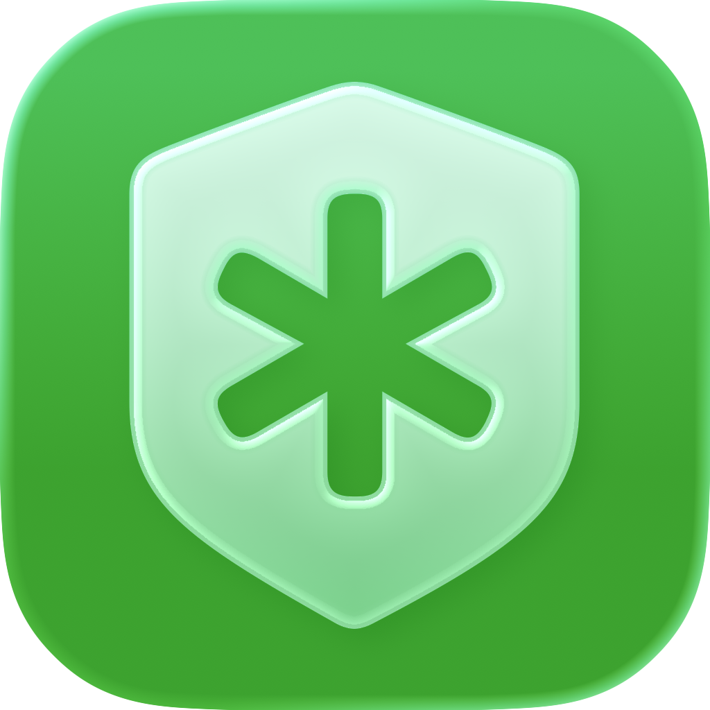
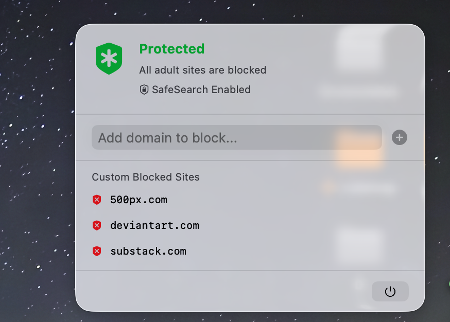

<p align="center">
  
</p>

<h1 align="center">CleanBrowse</h1>

<p align="center">
  A macOS menu bar app that blocks adult content at the system level.
</p>

<p align="center">
  <a href="https://github.com/EngOmarElsayed/CleanBrowse/releases/latest"></a>
  
  
  <a href="LICENSE"></a>
</p>

---

<p align="center">
  
</p>

## What is CleanBrowse?

CleanBrowse is a lightweight macOS menu bar application that provides system-level protection against adult content. It runs quietly in the background, blocking access to inappropriate websites across all browsers and applications on your Mac.

## Features

- **System-wide blocking** — Blocks ~249,000 adult domains via `/etc/hosts` modification
- **DNS Proxy** — Intercepts DNS queries system-wide using a Network Extension, preventing bypass through alternative DNS or encrypted DNS
- **Forced SafeSearch** — Enforces SafeSearch on Google, YouTube, Bing, and DuckDuckGo across ~190 country-code domains
- **Custom domain blocking** — Add your own domains to the blocklist through the menu bar UI
- **Anti-bypass riddle** — Requires solving a riddle before the app can be quit, adding friction against impulsive disabling
- **Launch at login** — Automatically starts with your Mac
- **Minimal footprint** — Lives in the menu bar with no Dock icon or main window

## How It Works

CleanBrowse uses a three-layer blocking strategy:

| Layer | Method | What it does |
|-------|--------|-------------|
| **Hosts file** | `/etc/hosts` rewrite | Redirects blocked domains to `127.0.0.1` |
| **DNS Proxy** | `NEDNSProxyProvider` | Intercepts all DNS query types (A, AAAA, HTTPS/SVCB) and returns NXDOMAIN for blocked domains |
| **SafeSearch** | IP-level redirect | Forces search engines to use their SafeSearch/restricted mode IPs |

## Requirements

- macOS 14 (Sonoma) or later
- Admin password (required on first launch to modify `/etc/hosts`)

## Installation

### Download

Download the latest `.zip` from the [Releases](https://github.com/EngOmarElsayed/CleanBrowse/releases/latest) page, unzip it, and move `CleanBrowse.app` to your Applications folder.

### Build from source

1. Clone the repository:
   ```bash
   git clone https://github.com/EngOmarElsayed/CleanBrowse.git
   ```
2. Open `CleanBrowse.xcodeproj` in Xcode
3. Build and run (requires an Apple Developer account for the Network Extension entitlement)

## Usage

1. Launch CleanBrowse — it appears as a shield icon in the menu bar
2. On first launch, you'll be prompted for your admin password to apply the blocklist
3. The DNS proxy activates automatically
4. To add custom domains, click the menu bar icon and type a domain in the input field
5. To quit, click the power icon — you'll need to solve a riddle first

## Tech Stack

- **SwiftUI** — UI framework
- **SwiftData** — Persistence for custom blocked domains
- **Network Extension** — `NEDNSProxyProvider` for system-wide DNS interception
- **ServiceManagement** — Launch at login via `SMAppService`

## License

This project is licensed under the MIT License — see the [LICENSE](LICENSE) file for details.
