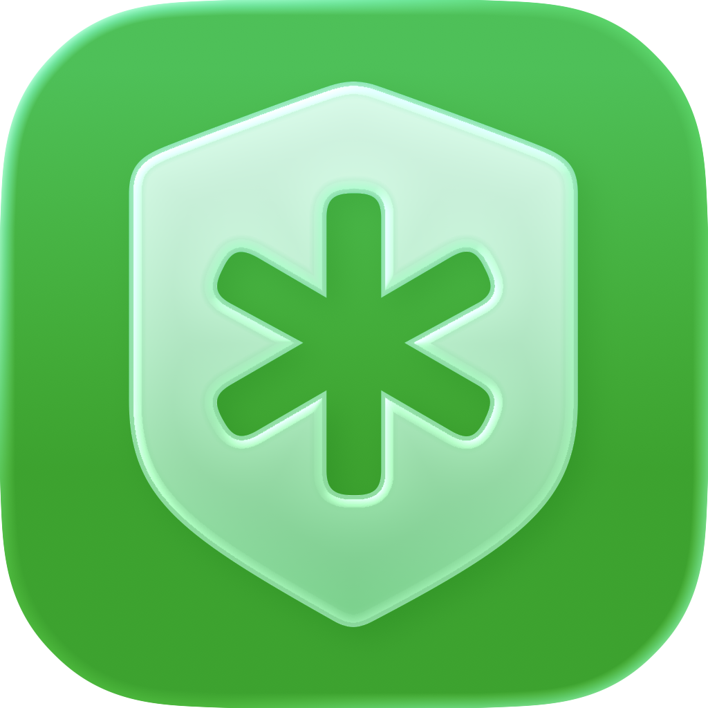
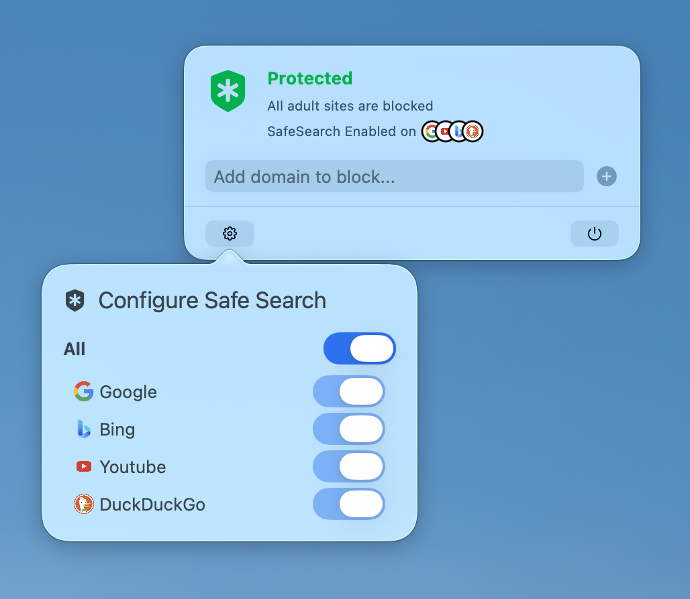

<p align="center">
  
</p>

<h1 align="center">CleanBrowse</h1>

<p align="center">
  <a href="https://viberank.dev/apps/CleanBrowse" target="_blank" rel="noopener noreferrer"></a>
</p>

<p align="center">
  <a href="https://www.producthunt.com/products/cleanbrowse-free-adult-content-blocker?embed=true&utm_source=badge-featured&utm_medium=badge&utm_campaign=badge-cleanbrowse-free-adult-content-blocker" target="_blank" rel="noopener noreferrer"></a>
</p>

<p align="center">
  <a href="https://github.com/EngOmarElsayed/CleanBrowse/releases/latest"></a>
  <a href="https://github.com/EngOmarElsayed/CleanBrowse/releases"></a>
  
  
  
  <a href="LICENSE"></a>
</p>

<p align="center">
  <b>The internet, minus the worst of it.</b><br>
  A free macOS menu bar app that blocks adult content at the system level —<br>
  in every browser, in every app. No accounts, no tracking, no subscription.
</p>

---

<p align="center">
  
</p>

## What is CleanBrowse?

CleanBrowse is a lightweight macOS menu bar app that provides system-level protection against adult content. It runs quietly in the background and blocks inappropriate websites across **all** browsers and applications on your Mac — protection that browser extensions can't match, because it works below them, at the DNS level.

**Version 1.0 marks CleanBrowse's first release out of beta** — with a rebuilt, faster and lighter DNS engine, six languages, and configurable SafeSearch.

## Features

- 🛡️ **System-wide blocking** — ~249,000 adult domains blocked via `/etc/hosts`, covering every app on your Mac
- 🌐 **DNS proxy** — a Network Extension intercepts every DNS query type system-wide, so blocking can't be bypassed with alternative or encrypted DNS
- 🔍 **Configurable SafeSearch** — enforces SafeSearch on Google, YouTube, Bing, and DuckDuckGo across ~190 country-code domains, with a per-engine toggle in the new settings panel
- 🖼️ **Safari image filter** — a Safari Web Extension blurs NSFW images and video frames on-device (CoreML) before you ever see them; nothing leaves your Mac
- 🗣️ **Speaks your language** — fully localized in English, Arabic (RTL included), French, Spanish, Chinese, and German
- ➕ **Custom domain blocking** — add your own domains to the blocklist right from the menu bar
- ⚡ **Faster & lighter** — the 1.0 engine resolves queries faster with a lower memory footprint and minimal battery impact
- 🚀 **Launch at login** — starts automatically with your Mac
- 🫥 **Minimal footprint** — lives in the menu bar; no Dock icon, no main window

## How It Works

CleanBrowse uses a three-layer blocking strategy — each layer backs up the others, so the protection holds everywhere:

| Layer | Method | What it does |
|-------|--------|-------------|
| **1 · Hosts file** | `/etc/hosts` rewrite | Redirects ~249,000 known adult domains to `127.0.0.1` — covers every application |
| **2 · DNS proxy** | `NEDNSProxyProvider` | Inspects all DNS query types (A, AAAA, HTTPS/SVCB) and answers NXDOMAIN for anything on the blocklist — what can't resolve can't load |
| **3 · SafeSearch** | IP-level redirect | Pins search engines to their SafeSearch/restricted-mode endpoints, so search results stay clean too |

## Requirements

- macOS 14 (Sonoma) or later
- Admin password (required on first launch to modify `/etc/hosts`)

## Installation

### Download

Grab the latest release from the [Releases](https://github.com/EngOmarElsayed/CleanBrowse/releases/latest) page, open the `.dmg`, and drag `CleanBrowse.app` into your Applications folder.

### Build from source

1. Clone the repository:
   ```bash
   git clone https://github.com/EngOmarElsayed/CleanBrowse.git
   ```
2. Build the Safari extension's JS bundle and CoreML model (both are generated, not committed):
   ```bash
   npm install && npm run build
   python3 -m venv .venv && .venv/bin/pip install -r Tools/requirements.txt
   .venv/bin/python Tools/convert_model.py   # downloads ~350MB, writes Models/BlurShieldNSFW.mlpackage
   ```
3. Open `CleanBrowse.xcodeproj` in Xcode
4. Build and run

> **Note:** the Network Extension entitlement requires an Apple Developer account to build and test locally.

## Usage

1. Launch CleanBrowse — it appears as a shield icon in the menu bar
2. On first launch, enter your admin password to apply the blocklist
3. The DNS proxy activates automatically — you're protected from that moment on
4. To block extra domains, click the menu bar icon and type a domain into the input field
5. To tune search filtering, open the ⚙️ settings and toggle SafeSearch per engine — Google, YouTube, Bing, and DuckDuckGo — or flip them all at once

## Roadmap

Version 1.0 is just the start. Here's what's on the road ahead:

| Checkpoint | Status |
|-----------|--------|
| **Custom DNS resolver** — choose the upstream DNS you trust (Cloudflare `1.1.1.1`, Google, or any resolver) | 🟢 Coming soon |
| **Protect me from myself** — lock your own settings so protection can't be switched off in a weak moment | 🛠️ In development |
| **Import any blocklist** — bring your own lists and CleanBrowse enforces them system-wide | 📋 Planned |
| **Blocked-domain explorer** — browse everything CleanBrowse blocks and check whether a domain is on the list | 📋 Planned |

## Tech Stack

- **SwiftUI** — UI framework
- **SwiftData** — persistence for custom blocked domains
- **Network Extension** — `NEDNSProxyProvider` for system-wide DNS interception
- **ServiceManagement** — launch at login via `SMAppService`
- **String Catalogs** — localization across all six languages

## Contributing

Contributions are welcome! Here's how you can help:

1. **Fork** the repository
2. **Create a branch** for your feature or fix:
   ```bash
   git checkout -b feature/your-feature-name
   ```
3. **Commit** your changes with a clear message
4. **Push** to your fork and open a **Pull Request**

### Ideas for contributions

- Expanding the blocklist with additional domains
- Improving DNS proxy performance
- Adding new SafeSearch engine support
- New translations, or polish for the existing six languages
- UI/UX improvements
- Bug fixes and documentation updates

> **Note:** Since CleanBrowse uses a Network Extension, you'll need an Apple Developer account to build and test locally.

## Why free?

> "Everyone should have the tools to protect themselves and their loved ones online — without a subscription, and without handing their data to anyone."

CleanBrowse is designed, built, and maintained by [Omar Elsayed](https://www.swiftdifferently.com/about) — and it's completely free. No accounts, no analytics on your browsing, nothing ever leaves your Mac.

## License

This project is licensed under the MIT License — see the [LICENSE](LICENSE) file for details.
